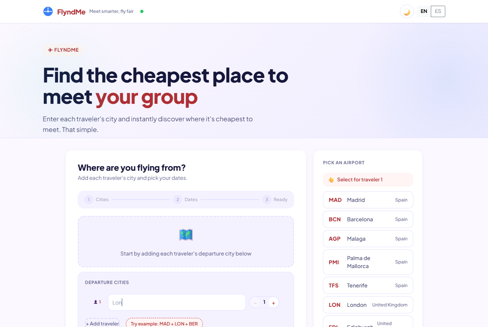
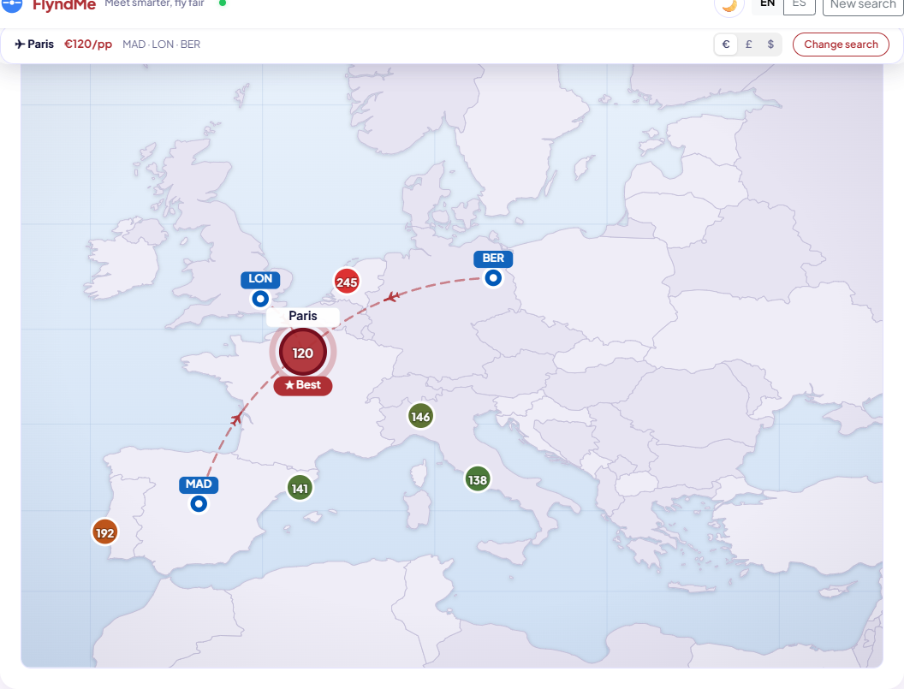

# FlyndMe

PWA que encuentra el destino más barato para que un grupo que sale de
ciudades distintas se encuentre. Compara vuelos desde múltiples orígenes
hacia múltiples destinos y optimiza por coste total del grupo o por equidad
entre viajeros (fairness score).

**Demo**: https://flyndme2.vercel.app · **API**: https://flyndme-backend.onrender.com

## Capturas

| Introduce las ciudades de cada viajero | Destino ganador y reparto del coste |
|:--:|:--:|
|  |  |



## Arquitectura

```
frontend/   React 18 + Vite + Bootstrap (PWA, i18n EN/ES)  → Vercel
backend/    Node + Express                                  → Render
            ├── routes/flights.js   búsqueda multi-origen por tiers, /verify, /cheaper-date
            ├── routes/share.js     enlaces compartibles (TTL 48h)
            ├── routes/groups.js    planificación de grupo (TTL 14 días)
            ├── services/travelpayoutsService.js  Aviasales Data API (rate limit, retry, cache)
            ├── services/serpapiService.js        verificación bajo demanda (Google Flights)
            ├── services/mockFlightService.js     fixtures deterministas (USE_MOCK=true)
            └── utils/kvStore.js    store con TTL: Upstash Redis o memoria
```

El backend busca por niveles (tiers) de destinos y corta en cuanto alcanza
`TARGET_RESULTS`. Los precios de Travelpayouts son una caché de búsquedas
recientes: se muestran como estimación (`verificationStatus: "skipped"`) y el
usuario puede comprobar el precio del ganador en vivo (`POST /api/flights/verify`,
SerpAPI / Google Flights, con cupo vigilado). Nunca se re-ordena por la
verificación.

La documentación viva del proyecto (arquitectura, decisiones, backlog) está en
`CLAUDE.md`.

## Desarrollo local

```bash
# Backend (puerto 5000)
cd backend
npm install
cp .env.example .env        # rellena TRAVELPAYOUTS_TOKEN o usa USE_MOCK=true
npm run dev

# Frontend (puerto 5173)
cd frontend
npm install
npm run dev
```

Con `USE_MOCK=true` en `backend/.env` la app funciona completa sin llamadas
externas (datos deterministas).

## Tests

```bash
cd backend  && npm test   # node --test, sin red (requiere npm install previo)
cd frontend && npm test   # harness SSR propio (tests/_loader.mjs)
```

Backend: contrato de la API (smoke end-to-end en modo mock), matemática
multi-pasajero, verificación de precios, deep links de afiliado, validaciones,
rate limits, caché, grupos y el aviso de fecha más barata. Frontend: helpers,
i18n, lógica de resultados y render completo de la App. En entornos sin acceso
a npm, ver `backend/dev-shims/README.md`.

Tras cambios de color o tema: `node frontend/scripts/theme-parity-audit.mjs 390`
(y `1366`); requisitos en la cabecera del script.

## Mantener despierto el backend

La instancia gratuita de Render se duerme tras 15 min sin tráfico y tarda
30-60 s en despertar. El frontend lo absorbe (ping al cargar y reintentos),
pero la primera búsqueda, el primer enlace compartido o el primer grupo tras
un rato sin visitas van lentos. El cron de GitHub (`keep-alive.yml`) se
ejecuta con horas de retraso, así que hace falta un pinger externo gratuito:

- **cron-job.org**: nuevo cronjob → URL `https://flyndme-backend.onrender.com/api/ping`,
  cada 5 minutos, método GET.
- **UptimeRobot** (alternativa): monitor HTTP(s) con la misma URL, intervalo 5 min.

`/api/ping` responde a GET y HEAD. Mantenerla despierta todo
el mes consume ~744 de las 750 horas gratuitas de Render: vale para un único
servicio gratuito en la cuenta.

## Variables de entorno

Ver `backend/.env.example` (servidor, mock, token y marker de Travelpayouts,
tuning de rate limit/cache, CORS) y `frontend/.env.production.example`
(`VITE_API_BASE_URL`, afiliado Skyscanner opcional).

## Registro de cambios

El historial actual está en `CLAUDE.md` (entradas «Hecho»). `MEJORAS.md` es
un registro histórico de junio de 2026.
